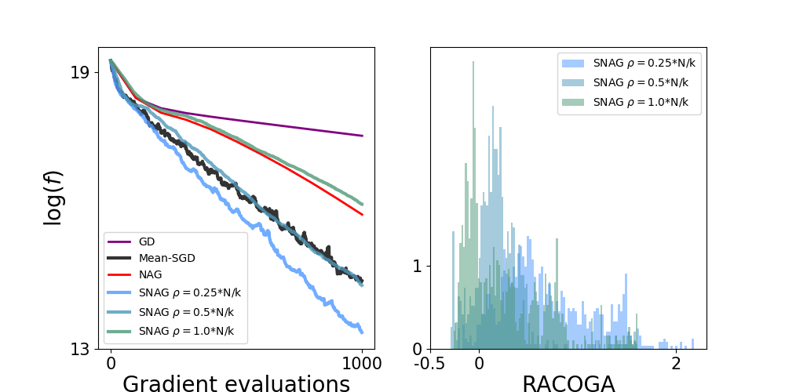

# Momentum_Stochastic_GD

This code analyses the converge of optimization framework in a convex and non-convex context. 
Several optimization algorithms are implemented (GD, SGD, Nesterov Accelerated Gradient, Stochastic Nesterov Accelerated Gradient, ADAM, RMSprop), and compute the Relaxed Averaged COrrelated Gradient Assumption (RACOGA) values of their iterates.




## Installation
To create a Python environment, please run the following command (change 'env_name' by your choice of name for the environment)

```
python -m venv env_name
```
To activate the environment, please run the following command
```
source env_name/bin/activate
```
To install librairie with correct version, please run the following command
```
pip install -r requirements.txt
```
Now you can run the code !

To download dataset and use then, you can save them in the folder 'dataset'. For instance, to load cifar10, please follow instruction in [https://stackoverflow.com](https://www.cs.toronto.edu/~kriz/cifar.html).


## File Structure
```
- dataset : collection of used datasets (CIFAR-10, SPHERE)
- Linear_Regression : code for solving the linear regression optimization problem (with interpolation)
  _ results : directory of experimental results
  _ linear_regression.py : code to generate features, compute RACOGA, and definite the algorithms (GD, NAG, SGD, SNAG)
  _ results.py : code to run algorithms and store functional and racoga values along iterations
  _ vizualisation.py : code to plot convergence curve of the algorithms and to track racoga values along iterations
  _ results_batch.py : same as "results.py", but designed to carry varying batchsize
  - vizualisation_batch.py : same as "vizualisation.py", but designed to carry varying batchsize
  - instability.py, link_racoga-curvature.py, racoga_on_sphere.py : vizualisation code
- Neural_Network : code for training Neural Network and compute a convergence analyse
  - figures : directory of figures
  - results : directory of experimental results
  - models_architecture.py : definition of the CIFAR-10 classifier architecture (MLP or CNN)
  - racoga_computation.py : code for computed the RACOGA quantity for a training
  - train_classifier_cifar10.py : code for training a classifier on CIFAR-10 or SPHERE
  - data_sphere_generation.py : code to generate the dataset SPHERE
  - sphere_visual.py : code to plot a visualization of the classification problem
  - utils : tools functions
  - vizualisation.py : code to generate figures associated to the results of experiments
```
