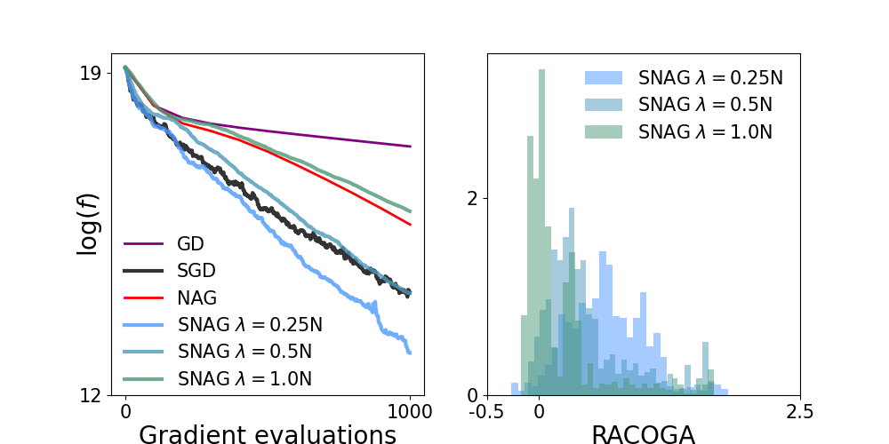

# Momentum_Stochastic_GD

This code analyses the converge of optimization framework in a convex and non-convex context. 
 several optimization algorithms, and compute the RACOGA values of their iterates.


## File Structure
```
- dataset : collection of used datasets (CIFAR-10, SPHERE)
- Linear_Regression : code for solving the linear regression optimization problem (with interpolation)
  _ results : directory of experimental results
  _ linear_regression.py : code to generate features, compute RACOGA, and definite the algorithms (GD, NAG, SGD, SNAG)
  _ results.py : code to run algorithms and store functional and racoga values along iterations
  _ vizualisation.py : code to plot convergence curve of the algorithms and to track racoga values along iterations
  _ results_batch.py : same as "results.py", but designed to carry varying batchsize
  - vizualisation_batch.py : same as "vizualisation.py", but designed to carry varying batchsize
  - instability.py, link_racoga-curvature.py, racoga_on_sphere.py : vizualisation code
- Neural_Network : code for training Neural Network and compute a convergence analyse
  - figures : directory of figures
  - results : directory of experimental results
  - models_architecture.py : definition of the CIFAR-10 classifier architecture (MLP or CNN)
  - racoga_computation.py : code for computed the RACOGA quantity for a training
  - train_classifier_cifar10.py : code for training a classifier on CIFAR-10 or SPHERE
  - data_sphere_generation.py : code to generate the dataset SPHERE
  - sphere_visual.py : code to plot a visualization of the classification problem
  - utils : tools functions
  - vizualisation.py : code to generate figures associated to the results of experiments
```
